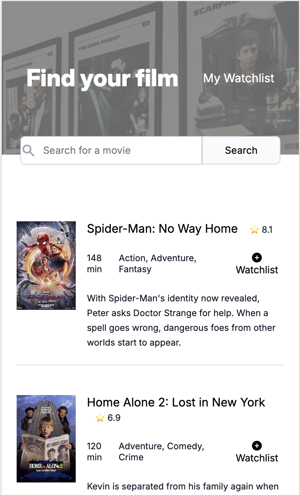
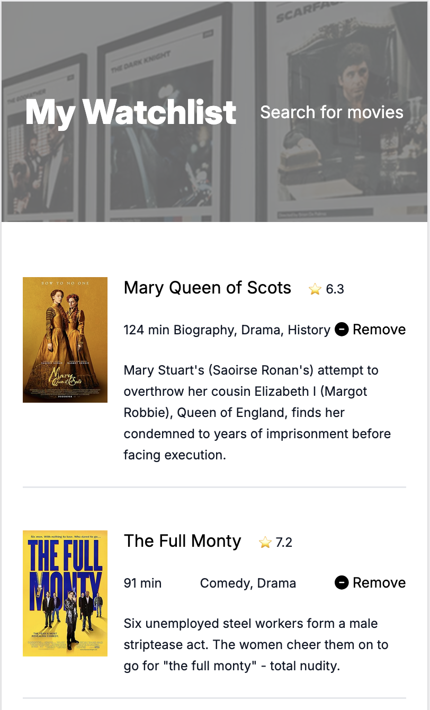

# Movie Watchlist

This is a Scrimba JavaScript solo project using the [Open Movie Database API](https://omdbapi.com/).  The project has 2 pages; a search page where the user can search for movies by title, and a watchlist page.  The user can add movies to their watchlist by clicking on the watchlist button on the search page.  They can remove movies from their watchlist by clicking the remove button either in on the search page or the watchlist page. The watchlist uses local storage.

## Screenshots of mobile views

# Search page with search form and results

# Watchlist page 
